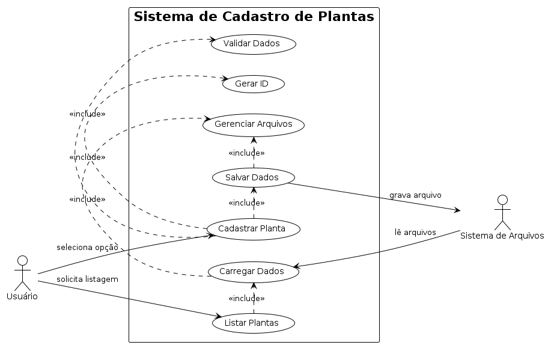
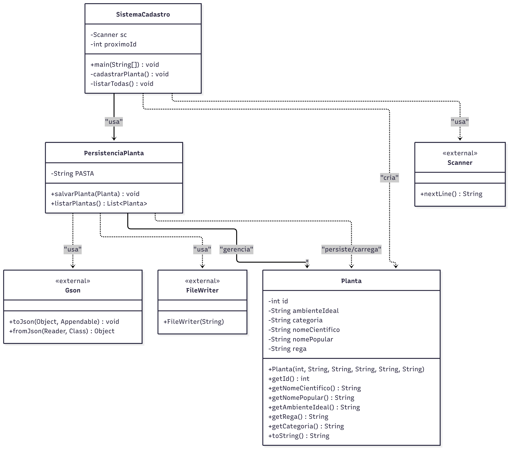

<<<<<<< HEAD
# gus.tads.testes
=======
# Sistema de Cadastro de Plantas

Sistema Java para cadastro e gerenciamento de plantas com persistência em arquivos JSON.

## 📋 Descrição

Este projeto implementa um sistema simples de cadastro de plantas que permite:
- Cadastrar novas plantas com informações detalhadas
- Listar todas as plantas cadastradas
- Persistir dados em arquivos JSON individuais
- Interface de linha de comando intuitiva

## 🏗️ Arquitetura

O sistema é composto por três classes principais:
- **Planta**: Modelo de dados representando uma planta
- **SistemaCadastro**: Interface principal e controle do fluxo
- **PersistenciaPlanta**: Gerenciamento de persistência em JSON

## 📊 Diagramas UML

### Diagrama de Casos de Uso

O sistema possui os seguintes casos de uso principais:



**Casos de uso identificados:**
- **Cadastrar Planta**: Permite ao usuário adicionar uma nova planta
- **Listar Plantas**: Exibe todas as plantas cadastradas
- **Validar Dados**: Validação interna dos dados inseridos
- **Gerar ID**: Criação automática de identificadores únicos
- **Salvar Dados**: Persistência em arquivos JSON
- **Carregar Dados**: Recuperação de dados dos arquivos
- **Gerenciar Arquivos**: Administração do diretório de dados


### Diagrama de Classes



## 🚀 Como Executar

### Pré-requisitos
- Java 8 ou superior
- Maven 3.6 ou superior

### Compilação
```bash
mvn clean compile
```

### Execução
```bash
mvn exec:java -Dexec.mainClass="br.com.cadastroplantas.SistemaCadastro"
```

Ou compile e execute diretamente:
```bash
mvn clean package
java -cp target/classes br.com.cadastroplantas.SistemaCadastro
```


## 💾 Persistência de Dados

As plantas são salvas individualmente em arquivos JSON no diretório `dadosPlantas/` com o formato:
- Nome do arquivo: `ID_NomePopular.json`
- Conteúdo: Objeto JSON com todos os atributos da planta

### Exemplo de arquivo JSON:
```json
{
  "id": 1,
  "ambienteIdeal": "muita luz solar direta (pelo menos 6 horas por dia)",
  "categoria": "Asteraceae",
  "nomeCientifico": "Helianthus annuus",
  "nomePopular": "Girassol",
  "rega": "3x ao dia"
}
```
